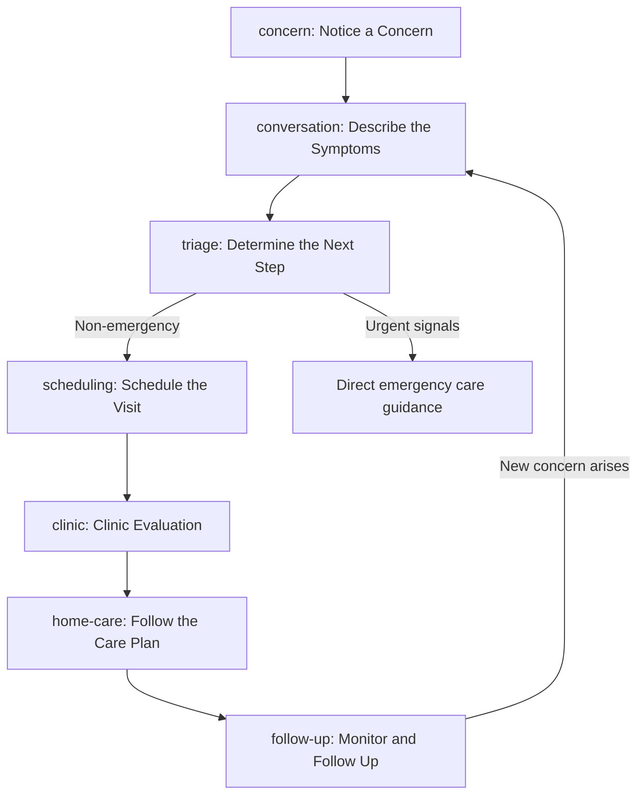

# Pet Care Coach — End-to-End Journey

*All scenarios below, including the canonical Jordan/Bailey case, are fictional demonstration material.*

## Journey summary

The journey follows Jordan Lee from first noticing that Bailey seems unwell, through a guided AI conversation and triage, to scheduling and completing a clinic visit with Dr. Maya Chen at Pine Ridge Veterinary Clinic, and finally through following and tracking the veterinarian-approved home-care plan. Throughout, the system distinguishes general information, AI-generated content, clinic-record data, and veterinarian-approved instructions, and defers to clinic staff or the owner at key decision points.

## Journey stages — overview table

| Stage ID | Stage label | Owner emotion | Primary feature IDs |
|---|---|---|---|
| `concern` | Notice a Concern | Anxious, uncertain | F-001, F-002 |
| `conversation` | Describe the Symptoms | Overwhelmed, wants to be heard | F-001, F-002, F-003 |
| `triage` | Determine the Next Step | Anxious, seeking clarity | F-002, F-003 |
| `scheduling` | Schedule the Visit | Motivated to act | F-003, F-004 |
| `clinic` | Clinic Evaluation | Hopeful, sometimes worried | F-003, F-005, F-006 |
| `home-care` | Follow the Care Plan | Responsible, sometimes uncertain | F-006, F-007, F-010 |
| `follow-up` | Monitor and Follow Up | Watchful, wants reassurance | F-005, F-008, F-009, F-011 |

## Detailed stage definitions

### `concern` — Notice a Concern

- **Owner goal:** Understand whether Bailey's symptoms are something to worry about right now.
- **Owner questions:** "Is this normal?" "Should I be worried?" "Do I need to do something right now?"
- **Owner emotion:** Anxious, uncertain.
- **Pain point:** Owner doesn't know whether symptoms warrant a vet visit or can wait.
- **System behavior:** Provides general educational information about common symptoms; does not diagnose.
- **Human responsibility:** Owner decides whether to start a conversation with the assistant.
- **Data captured:** Initial free-text concern description (e.g., "Bailey vomited twice, seemed less energetic than usual, and did not finish breakfast").
- **Safety consideration:** Must not discourage the owner from seeking care when uncertain; must not diagnose.
- **Product opportunity:** Offer quick symptom-severity prompts to guide the next step.
- **Relevant feature IDs:** F-001, F-002

### `conversation` — Describe the Symptoms

- **Owner goal:** Explain what's happening with Bailey in their own words.
- **Owner questions:** "What details matter?" "Am I giving enough information?"
- **Owner emotion:** Slightly overwhelmed, wants to be heard.
- **Pain point:** Owner may omit important details or use imprecise language.
- **System behavior:** Guided, structured conversation that asks clarifying questions (F-001).
- **Human responsibility:** Owner provides accurate information; the system does not verify accuracy.
- **Data captured:** Conversation messages, symptom details, timeline.
- **Safety consideration:** Must explicitly ask about known red-flag symptoms.
- **Product opportunity:** Structured prompts covering onset, severity, frequency, appetite, and energy.
- **Relevant feature IDs:** F-001, F-002, F-003

### `triage` — Determine the Next Step

- **Owner goal:** Learn whether this needs urgent care, a scheduled visit, or watchful waiting.
- **Owner questions:** "Is this an emergency?" "Can this wait?"
- **Owner emotion:** Anxious, seeking reassurance and clarity.
- **Pain point:** Owner may underestimate urgency or worry unnecessarily.
- **System behavior:** Applies escalation rules, flags urgent scenarios, and recommends a next step (never a diagnosis).
- **Human responsibility:** The owner (or clinic, for emergencies) makes the final decision to seek immediate care.
- **Data captured:** Triage summary, escalation flag, recommended next step.
- **Safety consideration:** Escalation guidance must be conservative, clearly non-diagnostic, and must direct to emergency care whenever uncertain.
- **Product opportunity:** Clear, calm escalation messaging with one obvious next action.
- **Relevant feature IDs:** F-002, F-003

### `scheduling` — Schedule the Visit

- **Owner goal:** Get Bailey seen by the clinic promptly.
- **Owner questions:** "When can we be seen?" "What should I bring?"
- **Owner emotion:** Motivated to act, wants a fast, simple process.
- **Pain point:** Friction in moving from conversation to booking.
- **System behavior:** Offers an appointment request/scheduling flow using the structured summary (F-004).
- **Human responsibility:** Clinic staff confirm and finalize the appointment.
- **Data captured:** Appointment details — date/time, visit type, clinic.
- **Safety consideration:** Non-emergency path only; urgent cases are redirected to direct clinic contact.
- **Product opportunity:** Pre-fill the appointment request from the conversation summary.
- **Relevant feature IDs:** F-003, F-004

### `clinic` — Clinic Evaluation

- **Owner goal:** Get an accurate evaluation and treatment for Bailey.
- **Owner questions:** "What did you find?" "What happens next?"
- **Owner emotion:** Hopeful, sometimes worried while waiting.
- **Pain point:** Limited visibility into what's happening during the visit.
- **System behavior:** Presents the structured clinic summary to staff (F-003, F-005); staff and veterinarian conduct the visit and record fictional diagnostic results.
- **Human responsibility:** The veterinarian and staff perform the actual examination, assessment, and treatment — the system never diagnoses.
- **Data captured:** Clinic visit record, fictional diagnostic results, treatment summary.
- **Safety consideration:** All diagnostic/treatment content must be clinician-entered or clinician-approved and clearly labeled.
- **Product opportunity:** Reduce the owner having to re-explain the concern by giving staff a ready summary.
- **Relevant feature IDs:** F-003, F-005, F-006

### `home-care` — Follow the Care Plan

- **Owner goal:** Correctly follow the veterinarian's instructions at home.
- **Owner questions:** "Am I doing this right?" "What do I watch for?"
- **Owner emotion:** Responsible, sometimes uncertain when instructions feel open to interpretation.
- **Pain point:** Instructions can be forgotten or misremembered after leaving the clinic.
- **System behavior:** Presents the care plan and task checklist (F-007); explains diagnostic results in plain language (F-006); labels sources clearly (F-010).
- **Human responsibility:** The veterinarian approves the care plan; the owner carries out the tasks.
- **Data captured:** Care task status and completion timestamps.
- **Safety consideration:** AI explanations must never override or contradict the veterinarian's written instructions.
- **Product opportunity:** A simple, visual task checklist with clear source labeling.
- **Relevant feature IDs:** F-006, F-007, F-010

### `follow-up` — Monitor and Follow Up

- **Owner goal:** Know whether Bailey is improving and get answers to new questions.
- **Owner questions:** "Is this normal recovery?" "Should I contact the clinic?"
- **Owner emotion:** Watchful, wants ongoing reassurance.
- **Pain point:** Uncertainty about when a new symptom warrants contacting the clinic again.
- **System behavior:** Answers follow-up questions (F-008), tracks adherence and progress (F-009), and surfaces unresolved concerns to the clinic (F-005) alongside QA evidence tracking (F-011).
- **Human responsibility:** Clinic staff review adherence and unresolved concerns; the owner contacts the clinic when escalation criteria are met.
- **Data captured:** Follow-up questions, adherence data, unresolved-concern flags.
- **Safety consideration:** Follow-up answers must stay educational and defer to clinic contact whenever in doubt.
- **Product opportunity:** A proactive nudge when a monitored symptom worsens.
- **Relevant feature IDs:** F-005, F-008, F-009, F-011

## Key handoffs

- **Owner → System:** Owner describes the concern in free text (`concern` → `conversation`).
- **System → Owner:** System returns a triage recommendation and escalation level (`triage`).
- **Owner → Clinic:** Owner requests/confirms an appointment (`scheduling`).
- **System → Clinic staff:** Structured clinic summary is handed off before/at the visit (`clinic`).
- **Clinic/Veterinarian → System/Owner:** Diagnostic results and the approved care plan flow back to the owner (`clinic` → `home-care`).
- **Owner → Clinic:** Adherence data and unresolved follow-up concerns are surfaced back to clinic staff (`follow-up`).

## Moments where the system must defer to a human

- Any escalation decision ultimately rests with the owner (or emergency services), never the system alone.
- Diagnosis, assessment, and treatment are performed only by the veterinarian.
- The care plan is authoritative only once approved by the veterinarian.
- Ambiguous or worsening follow-up questions defer to direct clinic contact rather than a new AI-generated instruction.

## Journey flowchart

## Three major design opportunities

1. Pre-fill the appointment request from the AI conversation summary so the owner never repeats themselves.
2. Apply consistent source/approval badges everywhere so owners always know if content is general information, clinic-record data, AI-generated, or veterinarian-approved.
3. Offer proactive follow-up nudges tied to specific monitored symptoms (vomiting, energy, appetite) rather than generic reminders.

## Three major safety risks

1. An owner might treat AI escalation guidance as a substitute for calling the clinic in a true emergency.
2. An AI-generated summary or explanation might be mistaken for a veterinarian-approved instruction if labeling is inconsistent.
3. The home-care task list could drift out of sync with updated clinic instructions if changes aren't explicitly re-approved by the veterinarian.
