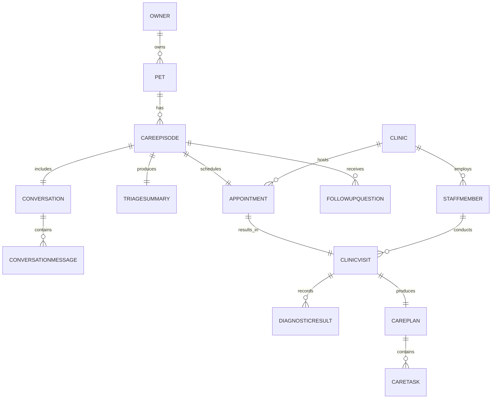

# Pet Care Coach — Domain and Data Model

*This document defines a conceptual model for an educational prototype. It is not a production legal, compliance, or data-retention specification. All clinical content referenced (e.g., `episode-bailey-2026-07`) is fictional demonstration data.*

## Entities

### Owner

- **Purpose:** Represents the pet's primary caregiver interacting with the assistant.
- **Important fields:** `ownerId`, `name`, `preferredName`, `communicationPreference`
- **Relationships:** Owns one or more Pets; participates in Conversations; requests Appointments.
- **Data ownership:** Owner-entered profile data.
- **Sensitivity classification:** Personal data (moderate).
- **Retention considerations:** Retained for the duration of an active care relationship; in this prototype the data is static demo data.

### Pet

- **Purpose:** Represents the animal receiving care.
- **Important fields:** `petId`, `name`, `species`, `breed`, `ageYears`, `weightLbs`, `sex`, `spayedNeutered`, `knownSensitivities`, `primaryClinicId`
- **Relationships:** Belongs to one Owner; has many CareEpisodes.
- **Data ownership:** Owner-entered, clinic-verified.
- **Sensitivity classification:** Health-adjacent personal data.
- **Retention considerations:** Retained for the life of the clinic relationship; static in this prototype.

### Clinic

- **Purpose:** Represents the veterinary clinic providing care.
- **Important fields:** `clinicId`, `name`, `address`
- **Relationships:** Employs StaffMembers; hosts Appointments and ClinicVisits.
- **Data ownership:** Clinic-entered.
- **Sensitivity classification:** Low (organizational data).
- **Retention considerations:** Static reference data.

### StaffMember

- **Purpose:** Represents clinic personnel involved in an episode.
- **Important fields:** `staffId`, `name`, `role` (`veterinarian` | `technician`), `clinicId`
- **Relationships:** Belongs to a Clinic; conducts ClinicVisits; approves CarePlans (veterinarian role only).
- **Data ownership:** Clinic-entered.
- **Sensitivity classification:** Low.
- **Retention considerations:** Static reference data.

### CareEpisode

- **Purpose:** The top-level record tying together one concern-to-follow-up cycle for a pet.
- **Important fields:** `episodeId`, `petId`, `ownerId`, `status`, `currentStageId`, `createdAt`, `updatedAt`
- **Relationships:** Has one Conversation, one TriageSummary, one Appointment, one ClinicVisit, one CarePlan, and many FollowUpQuestions.
- **Data ownership:** System-generated, referencing owner, pet, and clinic data.
- **Sensitivity classification:** High (aggregates health information).
- **Retention considerations:** Retained with the episode; static demo data in this prototype.

### Conversation

- **Purpose:** Captures the guided AI conversation with the owner.
- **Important fields:** `conversationId`, `episodeId`, `startedAt`, `endedAt`
- **Relationships:** Belongs to a CareEpisode; contains many ConversationMessages.
- **Data ownership:** Mixed — AI-generated (system prompts) and owner-entered (responses).
- **Sensitivity classification:** High (health-related free text).
- **Retention considerations:** Retained as the source for TriageSummary and the structured clinic summary.

### ConversationMessage

- **Purpose:** An individual turn in the conversation.
- **Important fields:** `messageId`, `conversationId`, `sender` (`owner` | `system`), `text`, `timestamp`
- **Relationships:** Belongs to a Conversation.
- **Data ownership:** Mixed, depending on sender.
- **Sensitivity classification:** High.
- **Retention considerations:** Same as Conversation.

### TriageSummary

- **Purpose:** Structured, AI-generated output classifying urgency and recommending a next step.
- **Important fields:** `triageId`, `episodeId`, `escalationLevel`, `recommendedNextStep`, `generatedBy`, `generatedAt`
- **Relationships:** Derived from a Conversation; feeds the Appointment flow and the clinic-facing summary.
- **Data ownership:** AI-generated.
- **Sensitivity classification:** High.
- **Retention considerations:** Retained with the episode; always labeled AI-generated, never a diagnosis.

### Appointment

- **Purpose:** The scheduled or requested clinic visit.
- **Important fields:** `appointmentId`, `episodeId`, `clinicId`, `dateTime`, `visitType`, `status`
- **Relationships:** Belongs to a CareEpisode; associated with a Clinic.
- **Data ownership:** Clinic-confirmed once booked.
- **Sensitivity classification:** Moderate (scheduling data).
- **Retention considerations:** Retained with the episode.

### ClinicVisit

- **Purpose:** Record of the actual in-clinic evaluation.
- **Important fields:** `visitId`, `appointmentId`, `staffId`, `examNotes`, `treatmentSummary`
- **Relationships:** Belongs to an Appointment; conducted by a StaffMember; produces DiagnosticResults and a CarePlan.
- **Data ownership:** Clinic/clinician-entered.
- **Sensitivity classification:** High (clinical data).
- **Retention considerations:** Retained with the episode; the authoritative clinical record.

### DiagnosticResult

- **Purpose:** Fictional diagnostic findings recorded during the visit.
- **Important fields:** `resultId`, `visitId`, `category` (`exam` | `imaging` | `lab`), `finding`, `isFictionalDemoData` (always `true`)
- **Relationships:** Belongs to a ClinicVisit.
- **Data ownership:** Clinician-entered.
- **Sensitivity classification:** High (clinical).
- **Retention considerations:** Retained with the episode; the source input for F-006 explanations.

### CarePlan

- **Purpose:** Veterinarian-approved home-care instructions.
- **Important fields:** `carePlanId`, `visitId`, `approvedBy`, `approvedAt`, `instructionsSummary`
- **Relationships:** Belongs to a ClinicVisit; has many CareTasks.
- **Data ownership:** Clinician-approved (authoritative).
- **Sensitivity classification:** High.
- **Retention considerations:** Retained; treated as authoritative over any AI-generated content.

### CareTask

- **Purpose:** An individual home-care action item.
- **Important fields:** `taskId` (e.g., `task-medication`), `carePlanId`, `description`, `status`, `completedAt`
- **Relationships:** Belongs to a CarePlan.
- **Data ownership:** Description sourced from the vet-approved plan; completion status is owner-entered.
- **Sensitivity classification:** Moderate to high.
- **Retention considerations:** Retained with the episode.

### FollowUpQuestion

- **Purpose:** A question the owner asks during home-care or follow-up.
- **Important fields:** `questionId`, `episodeId`, `question`, `answer`, `answeredBy` (`ai` | `clinic`), `escalationFlag`
- **Relationships:** Belongs to a CareEpisode.
- **Data ownership:** Question is owner-entered; answer is AI- or clinic-entered.
- **Sensitivity classification:** High.
- **Retention considerations:** Retained with the episode; reviewed by clinic staff (F-005, F-009).

### EscalationRule

- **Purpose:** Defines the logic used to classify urgency when generating a TriageSummary.
- **Important fields:** `ruleId`, `triggerCondition`, `escalationLevel`, `recommendedAction`
- **Relationships:** Referenced by the TriageSummary generation logic.
- **Data ownership:** System/product-defined configuration, not tied to a specific episode.
- **Sensitivity classification:** Low (configuration, not personal data).
- **Retention considerations:** Static reference data.

### SourceReference

- **Purpose:** Implements the source/approval labeling taxonomy (F-010) by tagging a piece of content.
- **Important fields:** `sourceRefId`, `relatedRecordId`, `sourceType`, `approvalStatus`, `generatedBy`, `lastUpdated`
- **Relationships:** Attached to Conversation, TriageSummary, DiagnosticResult explanations, CarePlan, CareTask, and other labeled content.
- **Data ownership:** System-generated metadata.
- **Sensitivity classification:** Low (metadata).
- **Retention considerations:** Retained alongside the record it labels.

## Entity-relationship diagram



## Sample CareEpisode (compact JSON shape)

```json
{
  "episodeId": "episode-bailey-2026-07",
  "petId": "pet-bailey",
  "ownerId": "owner-jordan-lee",
  "status": "home-care",
  "currentStageId": "home-care",
  "conversation": {
    "conversationId": "conv-bailey-2026-07-01",
    "summary": "Vomited twice, low energy, skipped breakfast."
  },
  "triageSummary": {
    "triageId": "triage-bailey-2026-07-01",
    "escalationLevel": "prompt-non-emergency",
    "recommendedNextStep": "scheduling",
    "generatedBy": "ai"
  },
  "appointment": {
    "appointmentId": "appt-bailey-2026-07-15",
    "clinicId": "clinic-pine-ridge",
    "dateTime": "2026-07-15T14:30:00-04:00",
    "visitType": "same-day-illness",
    "status": "completed"
  },
  "clinicVisit": {
    "visitId": "visit-bailey-2026-07-15",
    "staffId": "staff-maya-chen",
    "isFictionalDemoData": true
  },
  "carePlan": {
    "carePlanId": "careplan-bailey-2026-07-15",
    "approvedBy": "staff-maya-chen",
    "tasks": [
      "task-medication",
      "task-water",
      "task-small-meals",
      "task-activity",
      "task-monitor",
      "task-followup"
    ]
  }
}
```

## AI-generated vs. clinician-approved records

- **AI-generated:** Conversation system prompts, the TriageSummary, the diagnostic-result plain-language explanation (F-006 output — distinct from the DiagnosticResult itself), and FollowUpQuestion answers when `answeredBy` is `ai`.
- **Clinician-entered / clinician-approved:** ClinicVisit exam notes and treatment summary, DiagnosticResult findings, the CarePlan and its `approvedBy` field, and CareTask descriptions (only completion status is owner-entered).
- Every labeled record carries a SourceReference so the interface can always show whether content is general information, clinic-record data, an AI-generated summary, or a veterinarian-approved instruction, per the taxonomy defined in Feature F-010.
